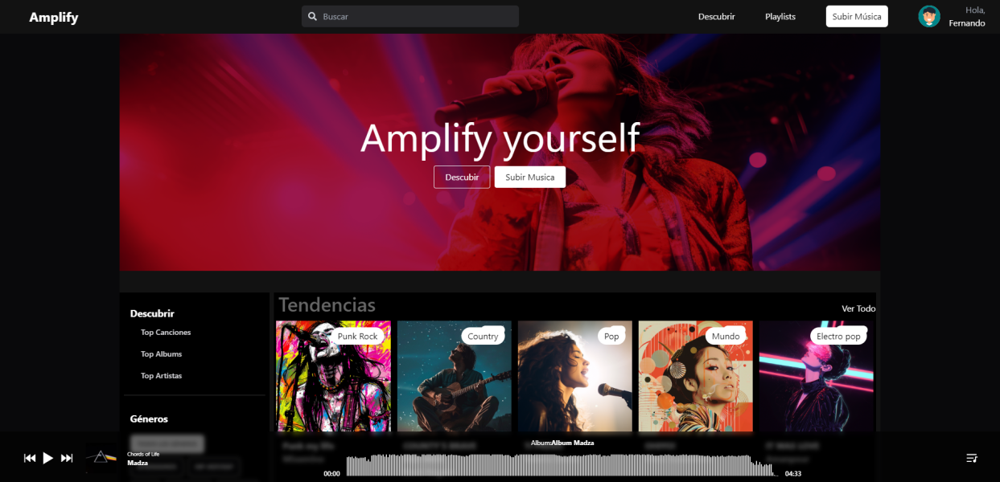

# **Amplify**

Amplify es una plataforma web de música diseñada para que cualquier persona pueda compartir y descubrir música con facilidad. Aunque está orientada a músicos amateurs, cualquier usuario puede cargar su música y acceder a una extensa biblioteca de canciones.

## **Características Principales**

### **🎵 Escuchar Música**

Accede a una vasta biblioteca de música de diferentes géneros y artistas. Disfruta de una experiencia de escucha de alta calidad con una interfaz intuitiva y fácil de usar.

### **🚀 Cargar Música**

Sube tus propias canciones y compártelas con una comunidad global. Ya seas un músico amateur o profesional, Amplify te permite compartir tu talento con el mundo.

### **🌟 Descubrir Nuevas Tendencias**

Explora música popular y nuevas tendencias en la sección de "Tendencias". Mantente al día con lo que está sonando y descubre nuevos artistas y géneros.

### **🎶 Listas de Reproducción**

Crea y administra tus propias listas de reproducción personalizadas. Agrupa tus canciones favoritas y escucha lo que más te gusta en cualquier momento.

### **💻 Interfaz Intuitiva**

Navegación fácil y diseño moderno orientado a mejorar la experiencia del usuario. Amplify está diseñado para que encuentres y disfrutes música sin complicaciones.

## **Tecnologías Utilizadas**

### **Frontend:**

- **React:** Librería de JavaScript para construir interfaces de usuario.
- **HTML5 & CSS3:** Estructura y estilos de la aplicación.
- **TypeScript:** Lógica de frontend.

### **Backend:**

- **Node.js:** Entorno de ejecución para JavaScript.
- **Express:** Framework para construir aplicaciones web con Node.js.

### **Base de Datos:**

- **MongoDB:** Base de datos NoSQL orientada a documentos.

### **Almacenamiento de Archivos:**

- **Cloudinary:** Servicio de almacenamiento en la nube para guardar archivos de música.

### **Autenticación:**

- **JWT (JSON Web Tokens):** Sistema de autenticación segura.

### 👥 Equipo de Trabajo

### 👩‍💼 Project Manager

|                                                                                                                                                                                                                                                                                      |
| :-----------------------------------------------------------------------------------------------------------------------------------------------------------------------------------------------------------------------------------------------------------------------------------------------------------------------------------------: |
|                                                                                                                                                           **Yefferson Espinoza**                                                                                                                                                            |
|   |

### 🎨 Diseñador UX/UI

|                                                                                                                                                                                                                                                                                                 |
| :--------------------------------------------------------------------------------------------------------------------------------------------------------------------------------------------------------------------------------------------------------------------------------------------------------------------------------------------------: |
|                                                                                                                                                                  **Diego Gonzalez**                                                                                                                                                                  |
|   |

### ⚛️ Frontend Developers

|                                                                                                                                                                                                                                                                      |                                                                                                                                                                                                                                                                                         |                                                                                                                                                                                                                                                                                         |                                                                                                                                                                                                                                                                                          |
| :--------------------------------------------------------------------------------------------------------------------------------------------------------------------------------------------------------------------------------------------------------------------------------------------------------------------------------------------: | ------------------------------------------------------------------------------------------------------------------------------------------------------------------------------------------------------------------------------------------------------------------------------------------------------------------------------------------- | ------------------------------------------------------------------------------------------------------------------------------------------------------------------------------------------------------------------------------------------------------------------------------------------------------------------------------------------- | -------------------------------------------------------------------------------------------------------------------------------------------------------------------------------------------------------------------------------------------------------------------------------------------------------------------------------------------- |
|                                                                                                                                                              **Camilo Martinez**                                                                                                                                                               | **Alexander Mamani**                                                                                                                                                                                                                                                                                                                        | **Jostin Jerez**                                                                                                                                                                                                                                                                                                                            | **Emerson Suarez**                                                                                                                                                                                                                                                                                                                           |
|   |   |   |   |

### 🚀 Backend Developers

|                                                                                                                                                                                                                                                                                                   |                                                                                                                                                                                                                                                                                      |                                                                                                                                                                                                                                                                                                   |                                                                                                                                                                                                                                                                                                           |                                                                                                                                                                                                                                                                                             |
| :-----------------------------------------------------------------------------------------------------------------------------------------------------------------------------------------------------------------------------------------------------------------------------------------------------------------------------------------------------------: | :--------------------------------------------------------------------------------------------------------------------------------------------------------------------------------------------------------------------------------------------------------------------------------------------------------------------------------------: | :------------------------------------------------------------------------------------------------------------------------------------------------------------------------------------------------------------------------------------------------------------------------------------------------------------------------------------------------------------: | :------------------------------------------------------------------------------------------------------------------------------------------------------------------------------------------------------------------------------------------------------------------------------------------------------------------------------------------------------------: | :-----------------------------------------------------------------------------------------------------------------------------------------------------------------------------------------------------------------------------------------------------------------------------------------------------------------------------------------------: |
|                                                                                                                                                                      **Agustín Barrera**                                                                                                                                                                      |                                                                                                                                                              **Tomas Rave**                                                                                                                                                              |                                                                                                                                                                     **Rodrigo Georgetti**                                                                                                                                                                      |                                                                                                                                                                        **Juan Ramirez**                                                                                                                                                                        |                                                                                                                                                                  **Ariel Sordo**                                                                                                                                                                  |
|   |   |   |   |   |

### 🧑💻 TL

|                                                                                                                                                                                                                                                                                                |
| :------------------------------------------------------------------------------------------------------------------------------------------------------------------------------------------------------------------------------------------------------------------------------------------------------------------------------------------------------------: |
|                                                                                                                                                                       **Matias Acevedo**                                                                                                                                                                       |
|   |

